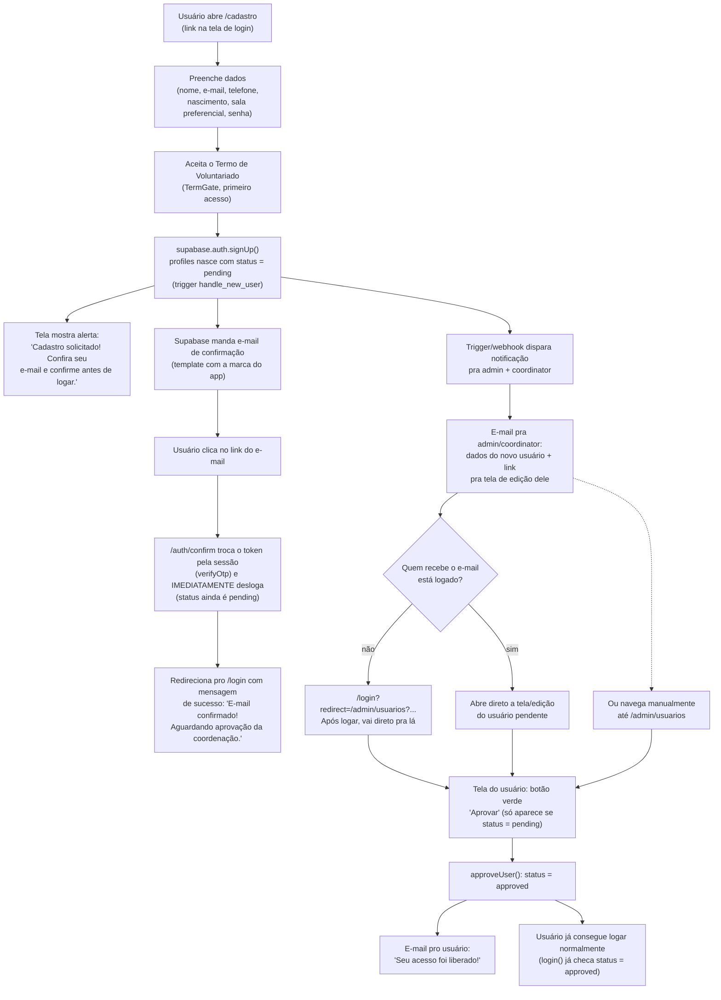

# Fluxo de cadastro + aprovação de voluntário

Referência de escopo pro ponto 3 do pedido do usuário (2026-09-08, ver cards
do Trello). Se o fluxo mudar durante a implementação, atualizar este arquivo
junto.

## Decisões de implementação

- **Confirmação de e-mail cria uma sessão momentânea** (é assim que o Supabase
  Auth funciona — `verifyOtp`/exchange do link seta cookies de sessão). Como
  `status` só é checado dentro de `login()` (`app/auth/actions.ts`), e não no
  `app/(app)/layout.tsx`, a rota de callback (`/auth/confirm`) precisa
  **deslogar explicitamente** logo depois de confirmar, antes de redirecionar
  — senão um usuário `pending` ficaria com sessão válida e acessaria o app
  sem estar aprovado. Isso replica o mesmo padrão que `login()` já usa pra
  status `pending`/`blocked` (sign out + mensagem).
- **Notificação de admin/coordenação** e **e-mail de aprovação pro usuário**
  usam Resend (provisionado via Vercel Marketplace, ver AGENTS.md). Domínio
  de envio (`impulsion.com.br`) ainda precisa verificar DNS no Resend — até
  lá, o envio falha (403), mas isso não trava o cadastro/aprovação em si
  (`lib/email.ts` nunca lança, só loga o erro). Implementado como chamada
  direta de dentro das Server Actions/Route Handler (`app/auth/notify-new-signup.ts`,
  `approveUser()`), sem Edge Function nem DB webhook — mais simples que o
  desenho original cogitava, já que o próprio Next.js já roda server-side
  no momento certo (confirmação de e-mail, aprovação).
- **Link de aprovação** aponta pra tela de usuários com um jeito de já abrir
  o registro certo (querystring `?highlight=<id>` ou rota própria — decidir
  na implementação da task "Deep link do e-mail pra tela do usuário").
- **Redirect pós-login** precisa validar que a URL de destino é interna
  (mesma origem), nunca redirecionar pra domínio externo vindo de query
  param sem validar (proteção contra open redirect).
